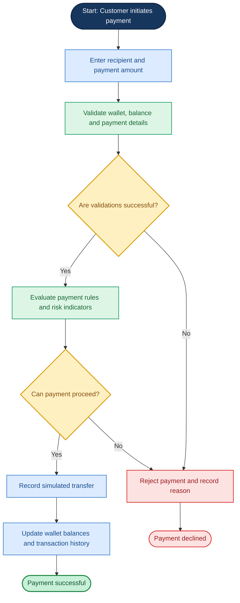
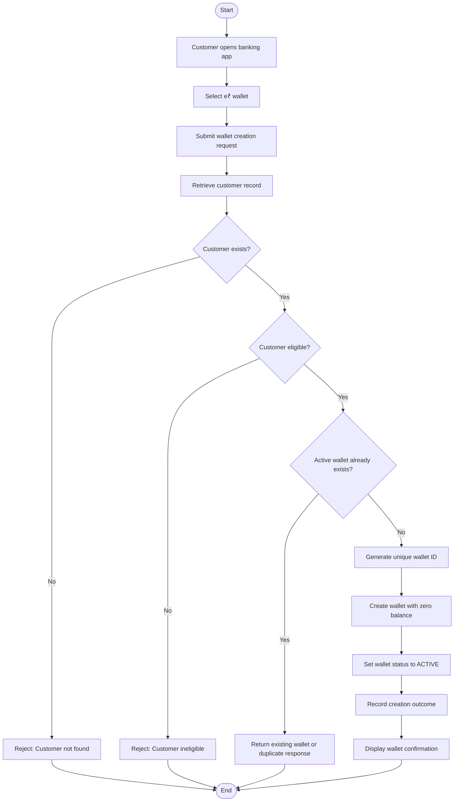
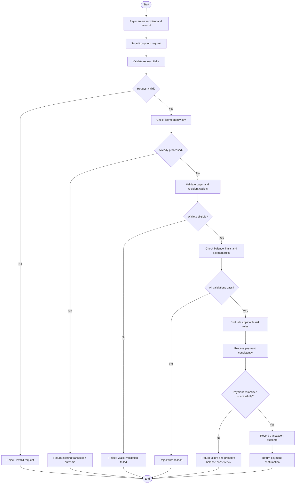
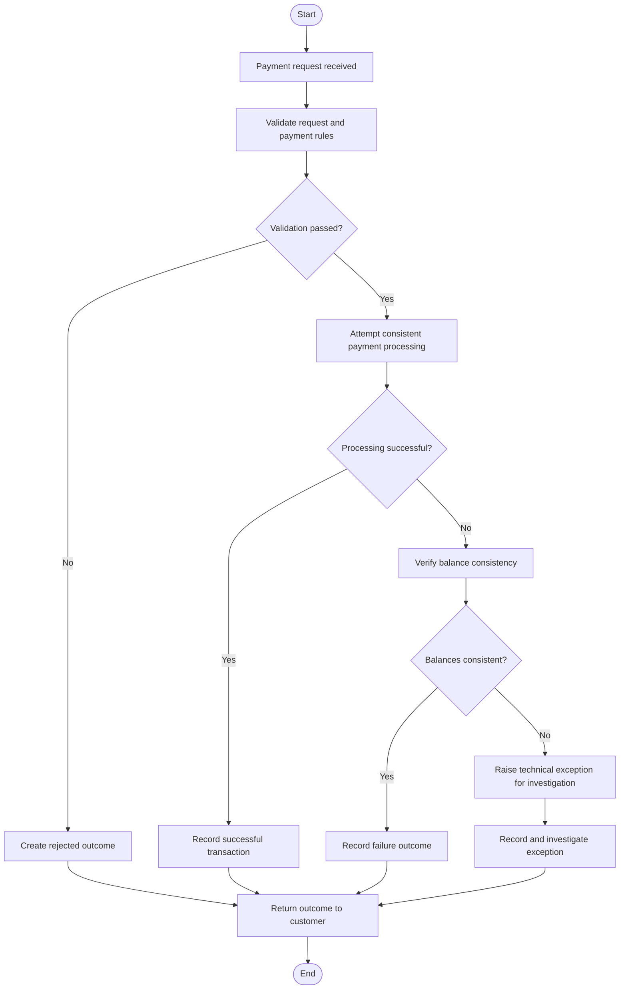

# ABC Bank – Digital Rupee (e₹) Transformation Program
## Business Process Maps

   ## Visual Overview — Digital Rupee Payment Process

The following flowchart illustrates the simulated payment journey, including validation, successful processing, and exception handling.

**Important:** This is a simulated payment process. It does not connect to the live Digital Rupee system or move real money.
### 1. Document Control

| Field | Details |
|---|---|
| Project | ABC Bank – Digital Rupee Transformation Program |
| Document ID | BPM-001 |
| Version | 1.0 |
| Status | Draft – Portfolio Simulation |
| Prepared By | BFSI / Digital Banking Transformation Consultant |
| Related Documents | BRD-001, FRD-001, US-001 |
| Date | 09 October 2026 |

### 2. Purpose

This document describes the key business process flows for the simulated Digital Rupee banking application.

The process maps identify:
- The users and systems involved.
- The sequence of business activities.
- The decisions and validations required.
- The successful and unsuccessful outcomes.
- The records and controls required.

These maps will guide detailed design, development and testing.

### 3. Process Map Notation

| Symbol / Element | Meaning |
|---|---|
| Start / End | Beginning or completion of a process |
| Rectangle | Business activity or system action |
| Diamond | Decision point |
| Arrow | Direction of process flow |
| Alternate branch | Different outcome depending on a condition |

The diagrams use Mermaid flowchart syntax and can be rendered by GitHub.

---

## Process 1 — Customer e₹ Wallet Creation

### 1.1 Business Objective

Allow an eligible simulated ABC Bank customer to create an active e₹ wallet while preventing ineligible or duplicate wallet creation.

### 1.2 Actors and Systems

- **Customer:** Initiates the wallet request.
- **Banking application:** Captures the request and displays the outcome.
- **Customer service:** Represents the simulated customer information source.
- **Wallet service:** Validates the request and creates the wallet record.

### 1.3 Preconditions

- The customer has a record in the simulated customer dataset.
- The customer meets the configured eligibility rules.
- The wallet service is available.

### 1.4 Process Flow

### 1.5 Business Rules

- Customer eligibility must be checked before creating a wallet.
- Every wallet must have a unique identifier.
- A customer must not receive unintended duplicate active wallets.
- A newly created wallet starts with a simulated balance of ₹0.
- Failed requests must not create a wallet.
- The system must return an understandable outcome to the customer.

### 1.6 Exceptions

| Exception | Expected Handling |
|---|---|
| Customer does not exist | Reject the request and return a suitable reason |
| Customer is ineligible | Reject without creating a wallet |
| Active wallet already exists | Return the existing wallet or a duplicate response according to policy |
| Wallet service fails | Return a controlled error and avoid an incomplete wallet record |
| Duplicate request is received | Prevent unintended duplicate wallet creation |

### 1.7 Outputs

- Wallet identifier, if created.
- Wallet status.
- Initial simulated balance.
- Request outcome and relevant error reason.
- Traceable creation record.

### 1.8 Requirement Traceability

- Business requirement: BR-001.
- Functional requirements: FR-WAL-001, FR-WAL-002.
- User story: US-WAL-001.

---

## Process 2 — Person-to-Person (P2P) Payment

### 2.1 Business Objective

Allow one eligible simulated customer to transfer value to another eligible wallet while maintaining consistent balances and traceable transaction records.

### 2.2 Actors and Systems

- **Payer:** Initiates the payment.
- **Recipient:** Receives the simulated payment.
- **Banking application:** Captures payment details and displays the outcome.
- **Payment service:** Validates and processes the payment.
- **Wallet / ledger service:** Maintains simulated balances and transaction records.
- **Risk service:** Evaluates configured illustrative risk rules.

### 2.3 Preconditions

- The payer and recipient have valid wallet records.
- The payer has sufficient available simulated balance.
- The payment service is available.

### 2.4 Process Flow

### 2.5 Business Rules

- Both wallet identifiers must be valid.
- The payer and recipient must be different wallets.
- Both wallets must satisfy the configured payment eligibility rules.
- The payment amount must be greater than zero.
- The payer must have sufficient available balance.
- The payment must comply with applicable limits and restrictions.
- Repeated requests must not produce unintended duplicate transfers.
- A successful transfer must debit and credit the appropriate wallets consistently.
- A rejected payment must not leave an unintended debit or credit.
- A risk alert is not automatically proof of fraud. The configured risk policy determines whether the transaction is allowed, held or rejected.

### 2.6 Exceptions

| Exception | Expected Handling |
|---|---|
| Invalid amount | Reject without changing balances |
| Insufficient balance | Reject and return the appropriate reason |
| Inactive wallet | Reject according to the wallet rules |
| Recipient not found | Reject without debiting the payer |
| Payment limit exceeded | Reject with a limit-related reason |
| Duplicate request | Return the existing outcome or prevent a second transfer |
| Processing failure | Preserve consistent balances and record the failure appropriately |
| Risk rule matched | Follow the configured risk policy and create an alert where required |

### 2.7 Outputs

- Transaction identifier.
- Transaction status.
- Payer and recipient references.
- Payment amount and timestamp.
- Rejection reason, if applicable.
- Risk alert, if a configured rule is triggered.

### 2.8 Requirement Traceability

- Business requirement: BR-003.
- Functional requirements: FR-PAY-001, FR-PAY-002, FR-PAY-003, FR-PAY-004.
- User story: US-PAY-001.

---

## Process 3 — Payment Exception Handling

### 3.1 Business Objective

Ensure that rejected or failed payment attempts are handled consistently, are traceable and do not cause unintended changes to simulated wallet balances.

### 3.2 Process Flow

### 3.3 Business Rules

- Every submitted payment must have a traceable outcome.
- Rejected requests must include a meaningful reason where possible.
- Failed processing must not silently leave inconsistent balances.
- Technical exceptions must be recorded for investigation.
- A retry must not unintentionally repeat a payment that has already succeeded.
- An operational exception must not be marked resolved until the required checks have been completed.

### 3.4 Exception Categories

- Business validation failure.
- Insufficient balance.
- Wallet or recipient eligibility failure.
- Duplicate request.
- Payment limit or rule violation.
- Technical processing failure.
- Potential ledger inconsistency requiring investigation.

### 3.5 Outputs

- Payment result and reason.
- Transaction reference, if assigned.
- Exception record, where required.
- Investigation status for unresolved technical issues.

### 3.6 Requirement Traceability

- Business requirements: BR-003, BR-006, BR-012.
- Functional requirements: FR-PAY-001, FR-PAY-002, FR-PAY-003, FR-PAY-004, FR-OPS-001.
- User stories: US-PAY-001, US-PAY-003, US-OPS-001.

---

## 4. Process Control Considerations

The process maps identify several controls that must be reflected in the design and tests:

1. **Eligibility control:** Prevent unauthorized or ineligible wallet creation.
2. **Input validation:** Reject malformed requests before processing.
3. **Duplicate prevention:** Prevent repeated requests from creating duplicate business outcomes.
4. **Balance integrity:** Keep simulated debit and credit updates consistent.
5. **Traceability:** Record transaction identifiers, statuses and relevant outcomes.
6. **Access control:** Limit customer and operational data to authorized users.
7. **Exception management:** Record and investigate unexpected failures.

These are proposed controls for the simulated portfolio solution. A production banking project would require a detailed risk assessment and formal control review.

## 5. Relationship to the Development Lifecycle

The process maps will be used by the project team in the following ways:

| Project Activity | How Process Maps Help |
|---|---|
| Functional design | Identify the steps, validations and outcomes the system must support |
| API design | Identify the information required at each interaction |
| Database design | Identify the records and relationships needed to support the flow |
| Development | Provide a shared understanding of expected behavior |
| Testing | Identify positive, negative and exception scenarios |
| Business acceptance testing | Help business users confirm that the end-to-end journey meets expectations |

## 6. Next Process Maps

Additional flows will be created as the project progresses:

- Merchant registration and P2M payment.
- Programmable payment rule evaluation.
- Risk alert review.
- Offline transaction synchronization and conflict handling.
- Reconciliation and exception resolution.
- Operational dashboard reporting.

## 7. Disclaimer

This document describes simulated business processes for an educational and portfolio reference implementation. It does not represent an actual bank's internal processes or RBI production architecture.
