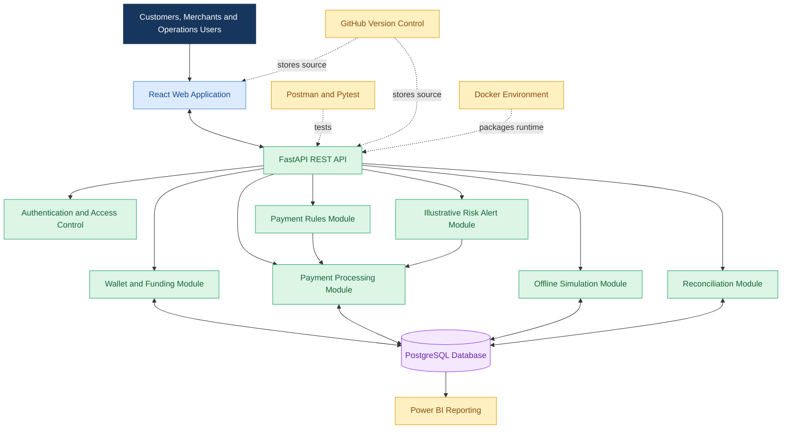

# ABC Bank – Digital Rupee (e₹) Retail CBDC Transformation Program

## Solution Architecture Document

### 1. Document Control

| Field | Details |
|---|---|
| Document ID | SAD-001 |
| Version | 1.0 — Portfolio Draft |
| Project | ABC Bank – Digital Rupee Retail CBDC Transformation |
| Document Type | Solution Architecture |
| Prepared By | BFSI / Digital Banking Transformation Consultant — Project Simulation |
| Status | Proposed design for educational purposes |

### 2. Purpose

This document describes the proposed logical and technical architecture for an educational simulation of a retail Digital Rupee wallet and payment platform.

It translates the business requirements, functional requirements, user stories and process maps into a proposed application structure.

**Important disclaimer:** This is a fictional portfolio project. It does not connect to the RBI, the live Digital Rupee system, real payment networks or real customer accounts. It does not issue real CBDC or move real money. It is not an official RBI architecture or an approved banking production design.

### 3. Architecture Objectives

The proposed solution should:

- Support simulated customer wallet creation and balance enquiries.
- Support simulated wallet funding, peer-to-peer (P2P) payments and merchant payments (P2M).
- Maintain a traceable record of simulated transactions.
- Demonstrate configurable payment rules and illustrative risk alerts.
- Demonstrate offline-payment scenarios without connecting to actual offline CBDC infrastructure.
- Support reconciliation and operational reporting.
- Provide a foundation for automated testing and future enhancements.

### 4. Proposed Architecture Diagram

### 5. Architecture Components

#### 5.1 Frontend — React

**Purpose:** Provides the user interface.

**Proposed functions:**
- Display wallet details and simulated balances.
- Provide forms to create wallets and initiate simulated payments.
- Display transaction history and payment statuses.
- Provide merchant and operations views.

**Interaction:** Sends API requests to the FastAPI backend and displays the responses.

#### 5.2 Backend — Python and FastAPI

**Purpose:** Applies business logic and processes application requests.

The initial implementation will use a modular backend rather than separate microservices. The modules below are logical responsibilities within one application.

**Wallet and Funding Module**
- Creates simulated wallets.
- Retrieves wallet details and balances.
- Records permitted simulated funding events.

**Payment Processing Module**
- Validates payment requests.
- Checks wallet status and available simulated balance.
- Coordinates payment rules and risk checks.
- Records the simulated transfer and associated balance changes.
- Prevents duplicate processing through an idempotency mechanism.

**Payment Rules Module**
- Evaluates configurable payment limits and other illustrative rules.
- Returns an allow, reject or review outcome based on the configured scenario.

**Risk Alert Module**
- Evaluates predefined demonstration scenarios.
- Records alerts for suspicious patterns in synthetic transactions.
- Does not represent a certified AML or fraud-detection system.

**Offline Simulation Module**
- Demonstrates locally recorded payment requests and later synchronization scenarios.
- Identifies duplicate or conflicting simulated requests.
- Does not implement real offline CBDC technology or guarantee offline double-spend prevention.

**Reconciliation Module**
- Compares simulated transaction records against expected wallet movements or a generated reference dataset.
- Identifies mismatches for review.
- Tracks exception status and resolution.

#### 5.3 Database — PostgreSQL

**Purpose:** Stores structured application data.

Proposed logical entities include:

- Customer
- Wallet
- Merchant
- Transaction
- PaymentRule
- RiskAlert
- ReconciliationRun
- ReconciliationException
- AuditEvent

The database design will be developed separately during the database-design phase.

Payment processing must use appropriate database transactions and consistency controls so that a successful simulated transfer does not update only one side of the transaction.

#### 5.4 Reporting — Power BI

**Purpose:** Presents operational and business insights.

Proposed measures include:
- Total simulated payment value and volume.
- Successful and declined payment counts.
- Payment failure reasons.
- Illustrative risk alerts by category.
- Reconciliation exceptions by status.

Reporting will use synthetic project data and appropriately controlled database queries or exports.

#### 5.5 Supporting Tools

| Tool | Proposed Use |
|---|---|
| GitHub | Version control and project documentation |
| Postman | Manual API testing |
| Pytest | Automated backend testing |
| Docker | Reproducible development environment |
| diagrams.net | Additional architecture and process diagrams |
| Power BI | Reporting and analytics |

### 6. Example Payment Request Flow

1. The customer enters a recipient and amount in the React application.
2. React submits a payment request to the FastAPI backend.
3. The backend validates the request and checks the relevant wallet records.
4. The payment module evaluates applicable configured rules and risk scenarios.
5. If approved, the backend records the simulated transfer and updates the corresponding balances consistently.
6. If declined, the backend records the outcome and an appropriate reason.
7. The frontend displays the resulting payment status.
8. The transaction record becomes available for history, reconciliation and reporting.

All processing takes place within the portfolio simulation.

### 7. Security and Control Considerations

The design should demonstrate the following controls:

- Server-side validation of all payment inputs.
- Authentication and role-based authorization for protected operations.
- Consistent database updates for simulated transfers.
- Duplicate-request protection through idempotency controls.
- Audit events for significant operations.
- Safe handling of credentials and configuration.
- Synthetic data only; no real customer information or banking credentials.
- Appropriate error messages without exposing sensitive technical details.

These are design objectives, not a claim of production-grade security or regulatory compliance.

### 8. Non-Functional Requirements

| Area | Proposed Requirement |
|---|---|
| Reliability | Failed or invalid payment requests should not result in partial balance updates. |
| Consistency | Successful simulated transfers should have consistent sender, recipient and transaction records. |
| Security | Protected functions should enforce authentication and authorization. |
| Traceability | Each simulated transaction should have a unique identifier and recorded status. |
| Testability | Business logic should support automated unit and API tests. |
| Maintainability | Business modules should have clear responsibilities. |
| Usability | The interface should provide clear payment statuses and validation messages. |
| Observability | Application errors and key business events should be logged appropriately. |

Performance targets will be defined after the initial application requirements and test environment are established.

### 9. Key Architecture Decisions

| Decision ID | Decision | Rationale |
|---|---|---|
| ADR-001 | Use React for the frontend | Supports a modern, interactive browser interface. |
| ADR-002 | Use Python and FastAPI for the backend | Enables a clear API design and approachable Python development. |
| ADR-003 | Use PostgreSQL for structured data | Supports relational records and transactional consistency. |
| ADR-004 | Start with a modular backend | Keeps the educational implementation manageable and easier to test. |
| ADR-005 | Use synthetic data and simulated payments | Avoids live banking integration and real-money movement. |
| ADR-006 | Use Power BI for analytics | Demonstrates reporting and business-insight capabilities. |

### 10. Scope Boundaries

**Included**
- Simulated wallets and funding.
- Simulated P2P and P2M payments.
- Transaction history and status.
- Configurable demonstration rules.
- Illustrative risk alerts.
- Offline-payment scenarios.
- Reconciliation and operational analytics.

**Excluded**
- Live RBI or CBDC integration.
- Real-money transfers or settlement.
- Actual CBDC issuance or redemption.
- Production banking authentication integrations.
- Certified AML, fraud-prevention or regulatory systems.
- Claims of RBI approval, certification or production readiness.

### 11. Traceability to Earlier Documents

| Earlier Artefact | How It Informs This Architecture |
|---|---|
| Project Charter | Defines project objectives and scope boundaries. |
| Business Requirements Document | Defines the business capabilities to support. |
| Functional Requirements Document | Defines system behaviours and controls. |
| User Stories and Acceptance Criteria | Provides testable user outcomes. |
| Business Process Maps | Describes the business workflows implemented by the system. |

### 12. Next Steps

1. Review and confirm the logical architecture.
2. Design the database entities and relationships.
3. Define API endpoints and request/response examples.
4. Prepare a development environment.
5. Build and test the application incrementally.
6. Create synthetic test scenarios and reporting datasets.

**Document status:** Proposed architecture for an educational portfolio simulation. Technical choices may be refined as implementation proceeds.
