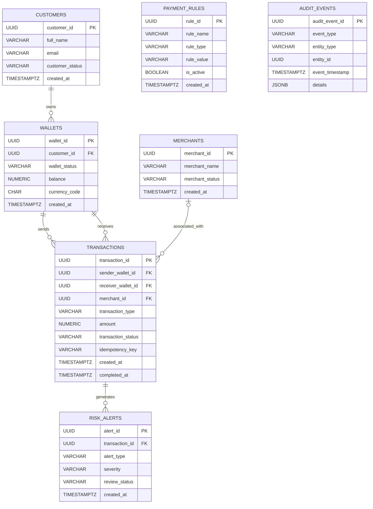

# ABC Bank – Digital Rupee (e₹) Retail CBDC Transformation Program

## Entity Relationship Diagram (ERD)

### 1. Document Information

| Field | Details |
|---|---|
| Document ID | ERD-001 |
| Version | 1.0 — Portfolio Draft |
| Related Document | Database Design Document (DBD-001) |
| Database | PostgreSQL |
| Purpose | Visualize entities, keys and relationships |

### 2. ERD Overview

The ERD describes the logical data model for the educational Digital Rupee wallet and payment simulation.

### 3. Relationship Explanations

#### Relationship 1: Customers and Wallets

- One customer can have zero or multiple wallets in the proposed data model.
- Each wallet belongs to one customer.
- `customer_id` in the WALLETS table references `customer_id` in CUSTOMERS.

**Business example:** A fictional customer creates a simulated wallet in the application.

#### Relationship 2: Wallets and Transactions — Sender

- One wallet can be the sender in multiple transactions.
- Each transaction may reference one sender wallet.
- `sender_wallet_id` references `wallet_id` in WALLETS.

The sender reference may be empty for a simulated funding event.

#### Relationship 3: Wallets and Transactions — Receiver

- One wallet can receive multiple transactions.
- Each transaction may reference one receiver wallet.
- `receiver_wallet_id` references `wallet_id` in WALLETS.

The receiver reference may be empty for transaction types that do not have a receiving wallet, subject to the applicable business rules.

#### Relationship 4: Merchants and Transactions

- A merchant can be associated with multiple transactions.
- A transaction may reference a merchant, depending on the transaction type.
- `merchant_id` references `merchant_id` in MERCHANTS.

For example, a simulated P2M payment can identify both the paying wallet and the merchant.

#### Relationship 5: Transactions and Risk Alerts

- One transaction can generate zero or multiple risk alerts.
- Each risk alert references one transaction.
- `transaction_id` in RISK_ALERTS references `transaction_id` in TRANSACTIONS.

These alerts demonstrate illustrative risk scenarios; they are not a production AML or fraud-detection system.

### 4. Standalone and Supporting Entities

**PAYMENT_RULES**

Stores configurable demonstration rules. The application evaluates applicable rules when processing a payment. The initial design does not require a direct foreign-key relationship between PAYMENT_RULES and TRANSACTIONS.

**AUDIT_EVENTS**

Stores records of significant application events. `entity_type` and `entity_id` identify the associated entity logically. Because the entity can vary, `entity_id` is not defined as a conventional foreign key in this initial model.

### 5. Key Design Controls

- Every table must have a primary key.
- Foreign-key values must reference valid parent records when populated.
- A successful simulated transfer must maintain consistent sender and receiver balance updates.
- Transaction amounts must be positive.
- Duplicate requests must be handled using an idempotency mechanism.
- The application must validate transaction types and the associated required fields.
- Database constraints should prevent invalid combinations of transaction status and required data where appropriate.
- Audit records must not contain passwords, tokens or other secrets.

### 6. Design Notes

1. The diagram is a logical data model, not a complete production database specification.
2. The initial model stores a balance on each wallet. A fuller financial ledger model may be introduced as an enhancement.
3. Payment-rule evaluation and reconciliation may require additional entities as implementation details are finalized.
4. Exact nullability, indexes, uniqueness rules and check constraints will be defined in the physical database schema.

### 7. Next Steps

1. Review the relationships against the business requirements and user stories.
2. Refine transaction-type constraints and the merchant-payment model.
3. Define the physical PostgreSQL schema.
4. Write SQL table-creation scripts.
5. Test relationships using synthetic records.

**Disclaimer:** This ERD describes an educational portfolio simulation. It is not an official RBI architecture and does not connect to a live Digital Rupee or payment system.
